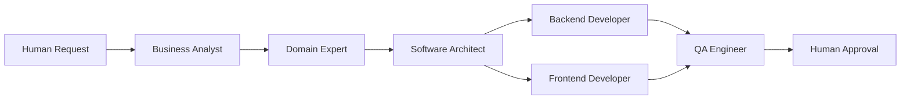
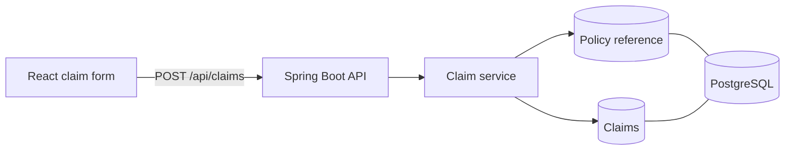

# Claims Agent Team

Claims Agent Team is a deliberately small full-stack claims application and an experiment in role-based, agent-assisted software delivery. Its main subject is not insurance software at scale, but how a feature moves from a human request through requirements, domain review, architecture, parallel implementation, independent QA, and final human approval.

## Current Status

**TASK-001 — Create Claim is complete:** it passed QA and received Human Approval. The application currently supports one bounded motor-claim reporting flow and is not a production insurance platform.

## Why This Repository Exists

The project explores whether explicit roles, authority boundaries, durable artifacts, and human decision points can make agent-based software delivery more controlled and reviewable.

| Concern | Purpose |
|---|---|
| **The application** | A minimal React and Spring Boot system that accepts and persists motor claim reports. It provides real full-stack behavior for design, implementation, integration, and testing. |
| **The delivery workflow** | Specialized agents own different decisions, hand work off through versioned artifacts, and escalate ambiguity instead of crossing role boundaries. |

The small application keeps the experiment focused on traceability: what was requested, who decided what, what was implemented, and how it was accepted.

## Delivery Workflow

Every feature begins as a task under `tasks/` and progresses through the roles defined in [`AGENTS.md`](AGENTS.md) and [`agents/`](agents/).



After the Software Architect defines a shared contract, backend and frontend work can proceed independently. QA evaluates the merged result, and human approval remains the final authority.

## Agent Team

| Role | Owns | Does not own |
|---|---|---|
| **Business Analyst** | Scope, requirements, acceptance criteria, edge cases | Domain rules, architecture, implementation |
| **Domain Expert** | Insurance rules, terminology, domain constraints | APIs, architecture, implementation |
| **Software Architect** | Technical design, component boundaries, API contract, data direction | Requirements or domain policy |
| **Backend Developer** | Server logic, persistence, authoritative validation, backend tests | Frontend or contract changes |
| **Frontend Developer** | UI behavior, client validation, API integration | Backend or contract changes |
| **QA Engineer** | Acceptance, integration, and regression verification; defect reporting | Redefining criteria or silently fixing defects |

The detailed operating rules for each role are versioned in [`agents/`](agents/).

## Artifact-Based Handoffs

Each feature has a workspace at `tasks/<task-id>/`. Its files form the source-controlled handoff record between roles:

| Artifact | Purpose |
|---|---|
| `request.md` | Original human request |
| `requirements.md` | Scope, requirements, acceptance criteria, and open questions |
| `human-decisions.md` | Explicit product or domain decisions supplied by the human |
| `domain-review.md` | Confirmed rules, rejected assumptions, and review status |
| `technical-design.md` | Architecture, API contract, ownership, and testing strategy |
| `backend-notes.md` / `frontend-notes.md` | Implementation and validation handoffs |
| `qa-report.md` | Independent acceptance and regression results |
| `human-approval.md` | Final human decision |

Agents read approved upstream artifacts before acting. Missing or contradictory decisions are escalated to their owner rather than assumed.

## Parallel Backend and Frontend Development

TASK-001 used separate Git branches and worktrees after the architecture and API contract were approved:

| Area | Branch | Worktree |
|---|---|---|
| Backend | `agent/task-001-backend` | `../claims-agent-team-backend` |
| Frontend | `agent/task-001-frontend` | `../claims-agent-team-frontend` |

Each developer role worked within its own checkout against the approved contract. The branches were merged into `main` and verified together before Human Approval.

## Application Architecture



The implementation intentionally uses a direct controller-service-repository flow with minimal dependencies and no speculative abstraction layers.

### Technology Stack

| Layer | Technology |
|---|---|
| Frontend | React 19, TypeScript 7, Vite 8 |
| Backend | Java 21, Spring Boot 3.5, Spring Web, Spring Data JPA, Spring Validation |
| Database | PostgreSQL 17 |
| Testing | JUnit, Spring MVC test support, Mockito, live PostgreSQL integration verification |
| Local orchestration | Docker Compose |

In development, the frontend calls the relative `/api` path and Vite proxies requests to the backend at `http://localhost:8080`.

## TASK-001: Create Claim

TASK-001 is the first completed request-to-approval example. It implements a single-page motor claim form backed by `POST /api/claims` and PostgreSQL.

Claims require a policy number, incident type, incident date, and description. The backend verifies policy existence, rejects future dates and unsupported incident types, generates a UUID claim number, and assigns `REPORTED`. Local setup seeds `MOTOR-POLICY-001` for demonstration.

This is intake only: `REPORTED` is not a coverage, liability, approval, or payment decision. Detailed rules, design, implementation notes, QA evidence, and approval are available in [`tasks/TASK-001-create-claim/`](tasks/TASK-001-create-claim/).

## Repository Structure

```text
claims-agent-team/
├── AGENTS.md                    # Team-wide workflow rules
├── agents/                      # Role definitions
├── backend/                     # Spring Boot API, persistence, and tests
├── frontend/                    # React/Vite client
├── tasks/
│   └── TASK-001-create-claim/   # Request-to-approval artifact trail
├── compose.yaml                 # Local PostgreSQL
└── README.md
```

## Run Locally

### Prerequisites

- Java 21 or newer
- Docker with Docker Compose
- Node.js 20 or newer
- npm

The backend includes the Maven Wrapper. Run the database, backend, and frontend in separate terminals.

### 1. Start PostgreSQL

```bash
docker compose up -d postgres
docker compose ps
```

PostgreSQL is exposed on host port `55432` and uses database/user/password `claims_agent_team` / `claims_agent` / `claims_agent`. Connection values can be overridden with `DATABASE_URL`, `DATABASE_USERNAME`, and `DATABASE_PASSWORD`.

### 2. Start the Backend

```bash
cd backend
./mvnw spring-boot:run
```

The backend starts at [http://localhost:8080](http://localhost:8080), initializes the schema, and seeds `MOTOR-POLICY-001` idempotently.

### 3. Start the Frontend

```bash
cd frontend
npm install
npm run dev
```

Open [http://localhost:5173](http://localhost:5173).

Use `Ctrl+C` to stop foreground processes and `docker compose stop postgres` to stop the database.

## API

The implemented endpoint is `POST /api/claims`:

```bash
curl -X POST http://localhost:8080/api/claims \
  -H 'Content-Type: application/json' \
  -d '{
    "policyNumber": "MOTOR-POLICY-001",
    "incidentType": "COLLISION",
    "incidentDate": "2025-01-15",
    "description": "Rear-end collision at a junction."
  }'
```

A successful request returns `201 Created` with a generated claim number:

```json
{
  "claimNumber": "550e8400-e29b-41d4-a716-446655440000",
  "status": "REPORTED"
}
```

Validation, missing-policy, and unexpected failures use a consistent error payload. The full contract is documented in [`technical-design.md`](tasks/TASK-001-create-claim/technical-design.md).

## Build and Verification

### Backend

```bash
cd backend
./mvnw test
./mvnw clean package
```

### Frontend

```bash
cd frontend
npm ci
npm run build
```

TASK-001 passed QA with 14 backend tests, successful backend and frontend builds, PostgreSQL 17/JPA startup verification, and live API/browser integration checks. No implementation defects were found. The frontend has no automated test framework; its behavior was verified through live integration and source inspection. See [`qa-report.md`](tasks/TASK-001-create-claim/qa-report.md) for full evidence and limitations.

## Workflow Principles

- **Human authority:** human instructions outrank artifacts, and acceptance requires Human Approval.
- **Role boundaries:** each agent owns defined decisions and does not redefine another role's work.
- **Artifact-based handoffs:** requirements, reviews, contracts, notes, and results become inputs to the next stage.
- **Separated ownership:** backend and frontend developers implement the same contract in their respective areas.
- **Independent QA:** QA verifies merged behavior and routes defects instead of silently fixing them.
- **Escalation over assumption:** ambiguity returns to the appropriate owner.

## Roadmap

The roadmap focuses on the delivery experiment rather than turning the prototype into a broad insurance platform:

- Apply the workflow to additional small, reviewable tasks.
- Improve traceability from acceptance criteria through implementation, tests, and approval.
- Evaluate repeatable handoff, blocking, and rework orchestration.
- Validate task artifacts and ownership boundaries automatically.
- Compare worktree-based parallel delivery across future tasks.
