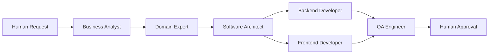
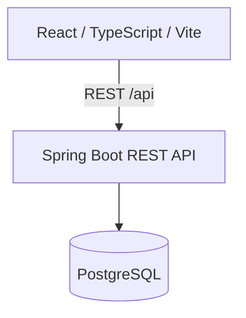

# Claims Agent Team

Claims Agent Team combines a small motor-claims application with an experiment in role-based, agent-assisted software delivery, from human request through implementation, independent QA, and Human Approval.

## Current Status

| Task | Status | QA | Human Approval |
|---|---|---|---|
| TASK-001 — Create Claim | COMPLETE | PASS | APPROVED |
| TASK-002 — Claim List and Detail | COMPLETE | PASS | APPROVED |

The application remains a deliberately small motor-claims prototype, not a production insurance platform. See the Human Approval records for [TASK-001](tasks/TASK-001-create-claim/human-approval.md) and [TASK-002](tasks/TASK-002-claim-list/human-approval.md).

## Why This Repository Exists

The main purpose is demonstrating controlled agent collaboration through role boundaries, artifact-based handoffs, independent QA, and Human Approval.

| Concern | Purpose |
|---|---|
| **The application** | Motor claim creation, listing, and details in React and Spring Boot. |
| **The delivery workflow** | Roles, versioned handoffs, independent QA, and Human Approval. |

## Delivery Workflow

Features begin under `tasks/` and follow [`AGENTS.md`](AGENTS.md) and the [role definitions](agents/).



After the shared technical design and API contract are approved, backend and frontend may work in parallel. QA verifies the merged result before Human Approval.

## Agent Team

| Role | Owns | Does not own |
|---|---|---|
| **Business Analyst** | Requirements, acceptance criteria, edge cases | Domain rules, architecture, implementation |
| **Domain Expert** | Insurance rules, terminology, domain constraints | APIs, architecture, implementation |
| **Software Architect** | Technical design, component boundaries, API contract, data direction | Requirements or domain policy |
| **Backend Developer** | Server logic, persistence, authoritative validation, backend tests | Frontend or contract changes |
| **Frontend Developer** | UI behavior, client validation, API integration | Backend or contract changes |
| **QA Engineer** | Acceptance, integration, and regression verification; defect reporting | Redefining criteria or silently fixing defects |

## Artifact-Based Handoffs

Each `tasks/<task-id>/` directory records handoffs:

| Artifact | Purpose |
|---|---|
| `request.md` | Original human request |
| `requirements.md` | Requirements and acceptance criteria |
| `human-decisions.md` | Human product/domain decisions |
| `domain-review.md` | Domain rules and approval |
| `technical-design.md` | Architecture, API contract, testing |
| `backend-notes.md` / `frontend-notes.md` | Implementation and validation handoffs |
| `qa-report.md` | Independent acceptance and regression results |
| `human-approval.md` | Final human decision |

[TASK-001](tasks/TASK-001-create-claim/) and [TASK-002](tasks/TASK-002-claim-list/) contain these artifacts.

## Parallel Backend and Frontend Development

TASK-001 and TASK-002 both used isolated backend/frontend worktrees against approved contracts, followed by merge, integrated independent QA, and Human Approval.

## Application Architecture



The backend uses a direct controller-service-repository flow.

### Technology Stack

| Layer | Technology |
|---|---|
| Frontend | React 19, TypeScript, Vite |
| Backend | Java 21, Spring Boot 3.5 |
| Database | PostgreSQL 17 |
| Testing | JUnit, Spring MVC test support, Mockito, live PostgreSQL integration verification |
| Local orchestration | Docker Compose |

Vite proxies relative `/api` requests to `http://localhost:8080`.

## Implemented Features

### TASK-001 — Create Claim

The frontend submits motor claims; the backend validates policy existence, incident type, required fields, and non-future dates. Creation generates a UUID, assigns initial `REPORTED`, and persists to PostgreSQL. Setup seeds `MOTOR-POLICY-001`.

This is intake only, without coverage, approval, or payment decisions. See [TASK-001 artifacts](tasks/TASK-001-create-claim/).

### TASK-002 — Claim List and Detail

The own-claim list opens directly, with backend-enforced ownership, history visibility, and 10-record pagination. Ordering is incident date descending, then created-at descending. Read-only details display `REPORTED`, `PENDING`, `APPROVED`, or `REJECTED`. Loading, empty, and error + Retry states support retrieval.

Ownership uses a trusted backend-side demo identity shared by all visitors; real authentication is not implemented. Legacy prototype-data backfill assigns missing ownership and migration timestamps, not original creation times. New claims preserve actual creation timestamps.

Users cannot change status; company-side processing, editing, and deletion are outside scope. See [TASK-002 artifacts](tasks/TASK-002-claim-list/).

## Repository Structure

```text
claims-agent-team/
├── AGENTS.md                    # Team-wide workflow rules
├── agents/                      # Role definitions
├── backend/                     # Spring Boot API, persistence, and tests
├── frontend/                    # React/Vite client
├── tasks/
│   ├── TASK-001-create-claim/
│   └── TASK-002-claim-list/
├── compose.yaml                 # Local PostgreSQL
└── README.md
```

## Run Locally

### Prerequisites

- Java 21 or newer
- Docker with Docker Compose
- Node.js 20.19+ on the 20.x line, or 22.12+ (Vite dependency requirement)
- npm

Use separate terminals; Maven Wrapper is included.

### 1. Start PostgreSQL

```bash
docker compose up -d postgres
docker compose ps
```

PostgreSQL is exposed on host port `55432` and uses database/user/password `claims_agent_team` / `claims_agent` / `claims_agent`. Override connections with `DATABASE_URL`, `DATABASE_USERNAME`, and `DATABASE_PASSWORD`.

### 2. Start the Backend

```bash
cd backend
./mvnw spring-boot:run
```

Backend: [localhost:8080](http://localhost:8080). Startup upgrades/validates the schema and seeds the demo policy. Stop old instances before upgrading; see [setup notes](backend/README.md).

### 3. Start the Frontend

```bash
cd frontend
npm ci
npm run dev
```

Open [localhost:5173](http://localhost:5173); if occupied, use Vite’s printed URL.

Use `Ctrl+C` to stop foreground processes and `docker compose stop postgres` to stop the database.

## API

| Endpoint | Behavior |
|---|---|
| `POST /api/claims` | Create a claim |
| `GET /api/claims` | List own claims; optional one-based `page`, default 1 |
| `GET /api/claims/{claimNumber}` | Retrieve own claim details |

Create a claim:

```bash
curl -X POST http://localhost:8080/api/claims \
  -H 'Content-Type: application/json' \
  -d '{
    "policyNumber": "MOTOR-POLICY-001",
    "incidentType": "COLLISION",
    "incidentDate": "2025-01-15",
    "description": "Rear-end collision at a junction."
  }'
```

Success: `201 Created`:

```json
{
  "claimNumber": "550e8400-e29b-41d4-a716-446655440000",
  "status": "REPORTED"
}
```

`GET /api/claims?page=1` returns `200 OK`, for example:

```json
{
  "items": [{
    "claimNumber": "550e8400-e29b-41d4-a716-446655440000",
    "policyNumber": "MOTOR-POLICY-001",
    "incidentType": "COLLISION",
    "incidentDate": "2025-01-15",
    "status": "REPORTED"
  }],
  "page": 1,
  "pageSize": 10,
  "totalItems": 1,
  "totalPages": 1
}
```

Errors use a consistent payload. Full contracts are in the [TASK-001 design](tasks/TASK-001-create-claim/technical-design.md) and [TASK-002 design](tasks/TASK-002-claim-list/technical-design.md).

## Build and Verification

### Backend

```bash
cd backend
./mvnw test
TASK002_POSTGRES_TESTS=true ./mvnw clean package
```

The flagged command requires PostgreSQL; it enables otherwise-skipped integration tests in isolated schemas.

### Frontend

```bash
cd frontend
npm ci
npm run build
```

| Accepted task | Recorded verification |
|---|---|
| TASK-001 | 14 backend tests; backend clean package and frontend build passed; PostgreSQL and browser/API verification passed; QA PASS, Human Approval APPROVED |
| TASK-002 | 45 backend tests including PostgreSQL integration passed; backend clean package and frontend production build passed; real browser/API verification passed; QA PASS, Human Approval APPROVED |

Evidence: [TASK-001 QA report](tasks/TASK-001-create-claim/qa-report.md) and [TASK-002 QA report](tasks/TASK-002-claim-list/qa-report.md). Frontend checks use the browser and source inspection, without an automated test framework.

## Workflow Principles

- **Human authority:** acceptance requires Human Approval.
- **Role boundaries:** respect each role’s decisions.
- **Artifact-based handoffs:** artifacts inform each stage.
- **Separated ownership:** backend/frontend follow the shared contract.
- **Independent QA:** QA verifies merged behavior and reports defects.
- **Escalation over assumption:** ambiguity returns to the appropriate owner.

## Roadmap

Planned delivery experiments:

- Apply the workflow to more tasks.
- Improve requirement-to-approval traceability.
- Evaluate handoff and rework orchestration.
- Automate artifact and boundary validation.
- Compare parallel delivery across tasks.
